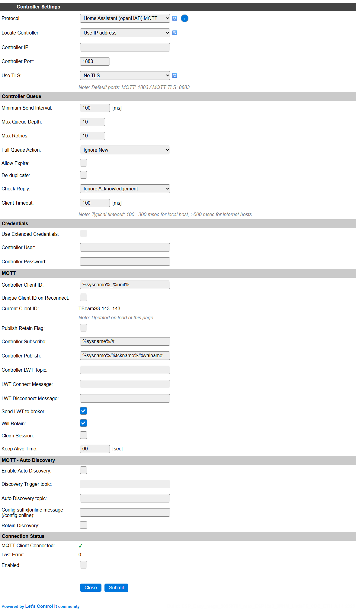

.. include:: _controller_substitutions.repl

.. _C005_page:

|C005_typename|
==================================================

|C005_shortinfo|

Controller details
------------------

Type: |C005_type|

Name: |C005_name|

Status: |C005_status|

GitHub: |C005_github|_

Maintainer: |C005_maintainer|

Description
-----------

The ``Home Assistant (openHAB) MQTT`` controller is one of the most standard "MQTT" controllers.
It has a very basic way of interacting with a MQTT broker and thus is not limited to "Home Assistant" or "OpenHAB".

Configuration
-------------

Controller settings
^^^^^^^^^^^^^^^^^^^

* **Protocol**: The selected Controller Protocol.

* **Locate Controller**: Select ``Use IP address`` or ``Use Hostname``. When set to ``Use Hostname``, an url for the server can be selected, like ``homeassistant.local``.

* **Controller IP** / **Controller Hostname**: This should be set to either an IP address or a hostname, depending on the **Locate Controller** setting.

* **Controller Port**: The default port number ``1883``, or ``8883`` when using a TLS connection, should be used.

* **Use TLS**: Select wether a plain MQTT or TLS MQTT connection should be used. Currently the TLS certificate is **not** verified when setting up the connection!

Controller Queue
^^^^^^^^^^^^^^^^

* **Minimum Send Interval**: The minimum time to wait before the next set of data can be sent to the controller. When using an MQTT server in the local network this can use the default 100 msec., but when using an external MQTT server, probably a higher value should be used, depending on what the server allows.

* **Max Queue Depth**: Determines the number of elements that can be stored in the queue before new samples are dismissed. When the receiving server is available, the data elements will be sent, emptying the queue, and making room for new samples again.

* **Max Retries**: Setting is not used for this controller.

* **Full Queue Action**: The controller always uses the ``Ignore New`` strategy when the queue is filled.

* **Allow Expire**: Not applicable for this controller.

* **De-duplicate**: When enabled, avoids sending duplicate data, comparing to what's currently in the send-queue.

* **Check Reply**: The controller always uses the ``Ignore Acknowledgement`` setting.

* **Client Timeout**: The timeout to allow before the connection is failing. When using an external internet service, a somewhat longer than the default timeout should be used. 1000 msec. should work in most cases, but on very high latency connections, this value can be increased.

Credentials
^^^^^^^^^^^

* **Use Extended Credentials**: When checked, longer credentials, f.e. a very long API-key, can be used, but this is stored in a different settings location (this feature was added later, and this checkbox is here for backward compatibility.)

* **Controller User**: The user name of code to be used at the MQTT Server.

* **Controller Password**: The password, or an API-key, can be entered to authenticate at the MQTT Server.

MQTT
^^^^

A group of MQTT specific settings:

* **Controller Client ID**: This setting is used for the MQTT Client connection.

* **Unique Client ID on Reconnect**: When checked will generate a unique client ID when connecting to the MQTT server, to avoid waiting for the previous client-id connection to expire.

* **Current Client ID**: Shows the calculated Client ID at load-time of the page.

* **Publish Retain Flag**: When publishing data accompanied by the Retain flag, the server will store the last sent data, and publish that when reconnecting.

This will override the **Retained** setting per Task that can be set for a MQTT Controller.

* **Controller Subscribe**: The topic(s) to subscribe to, so the MQTT Server can send data and optionally commands to this client-instance.

* **Controller Publish**: The topic to publish data to. This field supports variables so each value sent to the server can have a separate topic for its data.

Supported variables:

* ``%sysname%``: The name of the ESPEasy unit, as configured on the **Config** page.
* ``%tskname%``: The Taskname of the task the data is sent for.
* ``%valname%``: The Valuename for the value that's currently sent. MQTT Topics are (usually) only sending a single value per topic.
* ``%valX%``: The value content for Value X (range 1..4, and when using Derived values also 5..n for the number of Derived values). Not usually needed for MQTT topics.
* ``%vnameX%``: The value name for Value X (range 1..4, and when using Derived values also 5..n for the number of Derived values). Not usually needed for MQTT topics.

|

* **Controller LWT Topic**: When using the LWT (Last Will and Testament) feature of MQTT, this topic can be configured to listen for LWT messages.

* **LWT Connect Message**: The server has an LWT message content for Connect and Disconnect set, and when using LWT, these should be entered here.

* **LWT Disconnect Message**:

* **Send LWT to broker**: When checked, and LWT is configured, ESPEasy will also sent LWT Connect and Disconnect message when appropriate.

* **Will Retain**: Configuration to inform the server we will (or won't) retain the last message per topic received.

* **Clean Session**: When checked, the client-session will be cleaned when disconnecting from the server.

* **Keep Alive Time**: The time after which the MQTT broker will disconnect the client if no new data is sent. Range 0..65535 seconds, default 60. Should usually not be set below 15 seconds, to avoid frequent disconnects and reconnects (causing the AutoDiscovery, see below, to be re-sent...).

MQTT - Auto Discovery
^^^^^^^^^^^^^^^^^^^^^

(AutoDiscovery related settings added 2025/06/28)

* **Enable Auto Discovery**: When checked, the controller will send discovery data for all connected and enabled tasks to the MQTT server on first startup, and when receiving an ``online`` message in the Discovery Trigger Topic, when configured.

* **Discovery Trigger topic**: Default for Home assistant: ``homeassistant/status``

The discovery can be started by multiple triggers:

1) ESPEasy MQTT Controller start
2) Home assistant MQTT Broker startup, sending an ``online`` message (see below) in the topic ``homeassistant/status``
3) An explicit AutoDiscovery message for a single task by enabling the **Resend MQTT Discovery** checkbox and saving the task settings.

When Auto Discovery is triggered, it will be started after a random, non-blocking, delay between 1 and 30 seconds to spread the load on the MQTT Broker f.e. after a restart of Home assistant, requesting for a discovery, or after a power failure and many ESPEasy devices starting at nearly the same time.

* **Auto Discovery topic**: The topic that should be used for sending the Discovery data. For Home assistant, this is pre-filled with ``homeassistant/%devclass%/%unique_id%`` when initially adding the controller. The available variables are the same as for the **Controller Publish** setting, and extended with these:

Extra variables:

* ``%devclass%``: The device class for the current value. This could only be needed in the **Auto Discovery Topic**, and should usually not be used in the regular MQTT topics.
* ``%unique_id%``: The (generated) Unique ID for the current value. This is only needed in the **Auto Discovery Topic**, and should usually not be used in the regular MQTT topics.
* ``%element_id%``: The (generated) Element ID for the current value. This is only needed in the **Auto Discovery Topic**, and should usually not be used in the regular MQTT topics.

|

* **Config suffix|online message (/config|online)**: Default: Empty, for using the default values. When sending the Discovery data, the topic has to end with ``/config``, by default, but this setting can be changed in the Home assistant configuration. If this is changed, it should be added here (including the ``/`` prefix).

  Similarly, the ``online`` message, sent by Home assistant on startup to trigger the discovery process, can be changed. The value can be configured in this field, separated from the ``/config`` setting by a pipe symbol ``|``. If only the ``online`` message is to be changed and uses the default ``/config`` suffix, the pipe symbol still has to be inserted too!

* **Retain Discovery**: By default the Discovery data is sent *without* Retain flag set, but when enabling this option, it will be sent with Retain set.

Connection status
^^^^^^^^^^^^^^^^^

* **MQTT Client Connected**: Shows the current connection status of the (single) MQTT Client.

* **Last error**: Shows the last error code received from the broker. Should

* **Enabled**: When checked, the Controller is available for use.

NB: Only a single MQTT Server can be active at the same time, for reasons of limited available resources and limited (web)connections possible.

Command Handling
----------------

This controller can also be used to receive commands via the broker.
For this, there are several syntax formats to receive these commands:

* Subscribe to the configured subscription topic, with ``/cmd`` as the last part of the topic. 
  For example:

  * Topic: ``ESP_Easy/Bathroom_pir_env/cmd``
  * Message: ``gpio,14,0``
  * Full command:  ``gpio,14,0``

* Format the command as part of the topic, with the last parameter as data.
  For example:

  * Topic: ``ESP_Easy/Bathroom_pir_env/GPIO/14``
  * Message: ``0`` or ``1``
  * Full command:  ``gpio,14,0``

* Format the command as part of the topic, with a specific parameter as data. (added: 2022-03-01)
  This format allows the message to be a single parameter which will be inserted at the indicated position.
  For example:

  * Topic: ``ESP_Easy/Bathroom_pir_env/cmd_arg1/GPIO/0``
  * Message: ``14``
  * Full command:  ``gpio,14,0``

These topics used to receive commands do rely on the topic wildcard ``/#`` at the end of the subscribed topic string.
This wildcard is used in the default subscription topic for this MQTT controller.
If the format of the subscription topic is changed by the user, make sure to keep this wildcard in place for the command handling to work.

.. note:: The value of N in ``cmd_argN`` can also be 0. 
          The sent message is then the command, where the values in the topic are parameters.

Sending Events
--------------

Added: 2022/05/02

It can be useful to send events with 0 or more event values in the topic and the message as one of the event values.
For example with a message like these sent as a retained message, one can let the broker send out a message to the ESPEasy node as soon as it connects.

* Topic: ``ESP_Easy/Bathroom_pir_env/cmd_arg2/event/myevent/2/3``
* Message: ``1``
* Full event:  ``myevent=1,2,3``

Since a MQTT topic cannot contain a ``#`` sign in topics (at least, you shouldn't use it), the event sent via MQTT cannot contain a ``#`` character.

Please note that the nr in ``cmd_argN`` is the argument of the command, not the event.

For example sending an event with the event name as message and the values part of the topic:

* Topic: ``ESP_Easy/Bathroom_pir_env/cmd_arg1/event/1/2/3``
* Message: ``myevent``
* Full event:  ``myevent=1,2,3``

Change log
----------

.. versionchanged:: 2.0
  ...

  |added|
  Major overhaul for 2.0 release.

.. versionadded:: 1.0
  ...

  |added|
  Initial release version.

