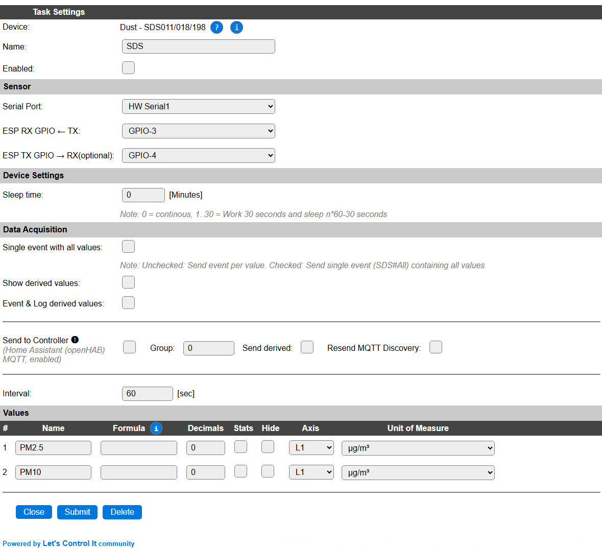

.. include:: ../Plugin/_plugin_substitutions_p05x.repl
.. _P056_page:

|P056_typename|
==================================================

|P056_shortinfo|

Plugin details
--------------

Type: |P056_type|

Port Type: |P056_porttype|

Name: |P056_name|

Status: |P056_status|

GitHub: |P056_github|_

Maintainer: |P056_maintainer|

Used libraries: |P056_usedlibraries|

Introduction
------------

A dust sensor will measure the dust concentration of the surrounding air. Depending on the device, different particle sizes can be measured, and the SDS series provides values for up to 2.5 and up to 10 micrometer particle size.

Multiple sensors can be used independently on a single ESP unit, as long as the serial port setup is uniquely configured.

Device
------

Task settings
~~~~~~~~~~~~~

* **Name** The name of the task. This should be unique for all devices that are configured. (Initially empty)

* **Enabled** For the device to work it has to be enabled. When checked, the device will be started as soon as the ESP starts. If desired, the device can also be enabled from f.e. a rule by using the ``TaskEnable,<tasknr>`` or ``TaskEnable,<taskname>`` command, or disabled using the corresponding ``TaskDisable,<tasknr>|<taskname>`` commands.

Sensor
~~~~~~

See: :ref:`SerialHelper_page`

Device Settings
~~~~~~~~~~~~~~~

* **Sleep time**: Numeric value to set the sleep time between measurements. The laser used in the sensor has an aproximated life time of 8000 hours of on-time. When enabled continuously, this number will be reached in about 333 days, so less than a year! To prolong the lifetime, a sleep interval can be configured, during which the laser will be turned on, and then turned off for ``<sleeptime>*60-30`` seconds. Range = 0 (continuous) or 1 .. 30 seconds.

This setting is only available if the optional **ESP TX GPIO** pin is configured correctly, as it involves sending a command to the sensor.

.. include:: DataAcquisition.repl

* **Interval**: By default, Interval will be set to 60 sec for this plugin. It is the frequency used to read sensor values and send these to any Controllers configured for this device. Values will *only* be sent if data is successfully received from the sensor.

Values
~~~~~~

The measured values are available in ``PM2.5`` and ``PM10``.

For a complete description of all available columns see the `Plugin - Values <_Plugin.html#values>`_ section.

|

Change log
----------

.. versionchanged:: 2.0
  ...

  |changed|
  2025-08-05: Enable multiple instances of the plugin, and update the documentation.

  |added|
  Major overhaul for 2.0 release.

.. versionadded:: 1.0
  ...

  |added|
  Initial release version.

