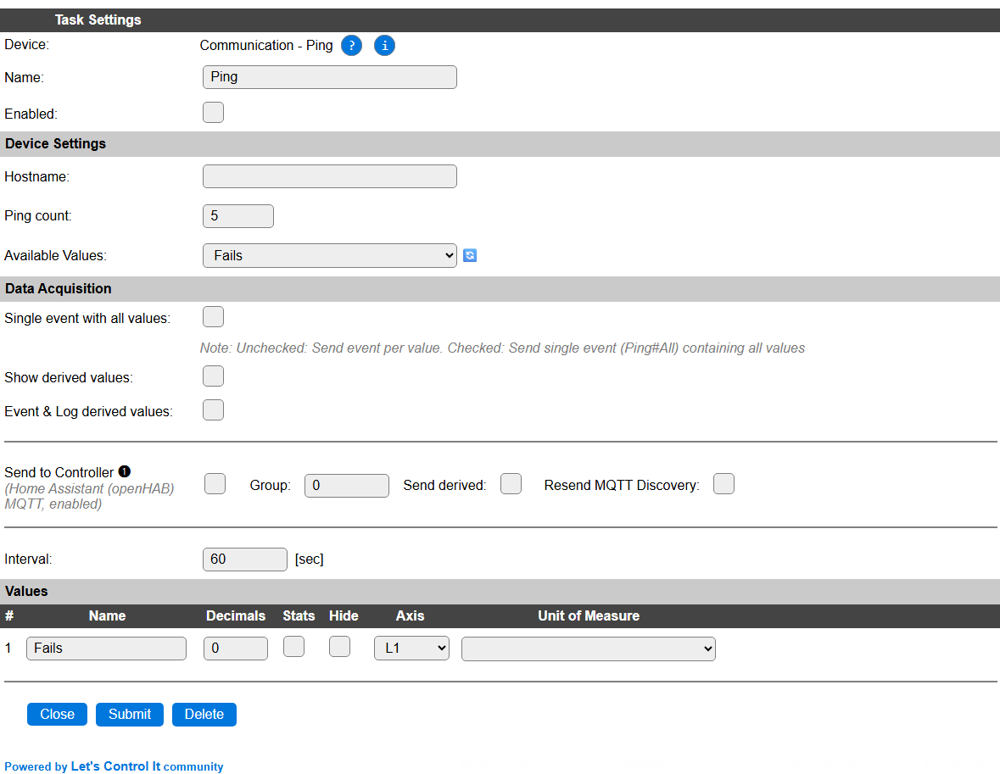

.. include:: ../Plugin/_plugin_substitutions_p08x.repl
.. _P089_page:

|P089_typename|
==================================================

|P089_shortinfo|

Plugin details
--------------

Type: |P089_type|

Name: |P089_name|

Status: |P089_status|

GitHub: |P089_github|_

Maintainer: |P089_maintainer|

Used libraries: |P089_usedlibraries|

Description
-----------

The Ping plugin is designed to check the availability of a local or remote device or host that can be reached via TCP/IP, and responds to ICMP requests (ping). If no response is received, the Fails counter is incremented, if the connection is restored after temporarily being disturbed, the Fails counter is auto-reset to 0.

Configuration
-------------

* **Name** A unique name should be entered here.

* **Enabled** The device can be disabled or enabled. When not enabled the device should not use any resources.

Device Settings
^^^^^^^^^^^^^^^

* **Hostname**: The hostname or IP-address for the device or host to monitor.

**ESP32 only:**

* **Ping count**: The number of pings that should be tried before reporting a failure. (Only available on ESP32 builds)

* **Available Values**: The default is to only have a **Fails** value available, but for ESP32 there is also the Average ping-time in msec. available.

When changing this setting, the page will save and reload to adjust for the change in **Values**, below.

.. include:: DataAcquisition.repl

* **Interval** By default, Interval will be set to 60 sec. Every Interval setting, the host will be pinged and the state will be updated in Fails. If the ping responds as intended, then Fails is reset to 0.

Values
^^^^^^

The failure count value is available in ``Fails``. On ESP32 there is an option to also show the average ping-time in msec. via ``Avg_ms``.

On ESP32, per Value is a **Stats** checkbox available, that when checked, gathers the data and presents recent data in a graph, as described here: :ref:`Task Value Statistics:  <Task Value Statistics>`

Commands available
^^^^^^^^^^^^^^^^^^

.. include:: P089_commands.repl

Change log
----------

.. versionchanged:: 2.0
  ...

  |added| 2025-08-26 Enable support for ESP32

  |changed| 2023-03-14 Extended command handling to not require the taskname argument.

  |added| 2020-02-22 
