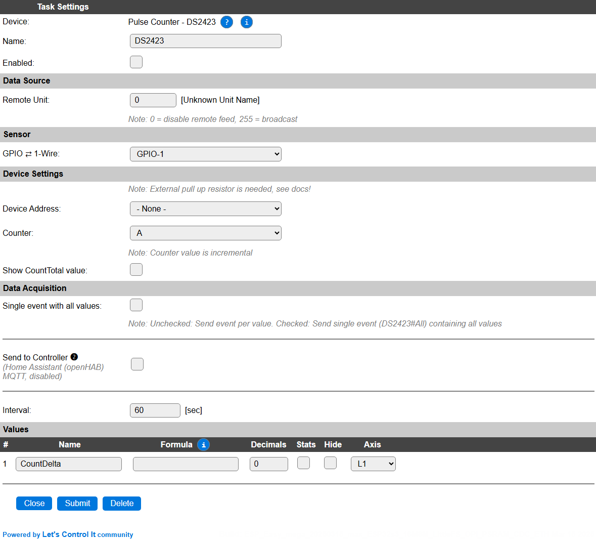
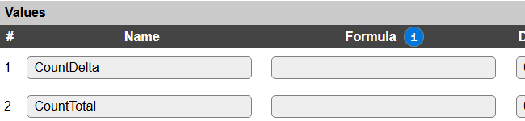

.. include:: ../Plugin/_plugin_substitutions_p10x.repl
.. _P100_page:

|P100_typename|
==================================================

|P100_shortinfo|

Plugin details
--------------

Type: |P100_type|

Name: |P100_name|

Status: |P100_status|

GitHub: |P100_github|_

Maintainer: |P100_maintainer|

Used libraries: |P100_usedlibraries|

Description
-----------

1-Wire pulse counter.

The module supports upto four 32-bit counters, of which 2 are with external trigger (A and B).

Configuration
-------------

* **Name**: Required by ESPEasy, must be unique among the list of available devices/tasks.

* **Enabled**: The device can be disabled or enabled. When not enabled the device should not use any resources.

Sensor
^^^^^^

* **GPIO <-> 1-Wire**: Select the GPIO pin the counter is connected to. Once this is set the next section will be available for configuration.

Device Settings
^^^^^^^^^^^^^^^

* **Device Address**: When 1 or more counters are connected to the unit, a counter can be selected based on the counter device address. (Multiple devices can be connected to the same GPIO pin.)

* **Counter**: Select either counter **A** or counter **B**, for each counter a separate task has to be configured, if you have wired both the **A** and **B** counter to a counter source.

* **Show CountTotal Value**: When checked, and the settings saved, the ``CountTotal`` value will also be shown, and sent to Controllers if so configured. The ``CountTotal`` value is available, wether this option is enabled or not (see below: **Get Config Values**).

.. include:: DataAcquisition.repl

* **Interval** By default, Interval will be set to 60 sec. The data will be collected and optionally sent to any configured controllers using this interval. When an output value is changed, the data will be sent to any configured controller, and an event will also be generated when the Rules are enabled (Tools/Advanced).

Values
^^^^^^

The plugin provides the ``CountDelta`` value, that will hold the delta compared to the previous read value, and optionally also the ``CountTotal`` value. This delta depends on the **Interval** value, as waiting longer for a new value will probably increase the counted difference. A formula can be set to recalculate. The number of decimals can be set as desired, though for a count that doesn't make much sense.

Per Value is a **Stats** checkbox available, that when checked, gathers the data and presents recent data in a graph, as described here: :ref:`Task Value Statistics:  <Task Value Statistics>`

.. Events
.. ~~~~~~
.. 
.. .. include:: P100_events.repl

Get Config Values
^^^^^^^^^^^^^^^^^

.. include:: P100_config_values.repl

Change log
----------

.. versionchanged:: 2.0
  ...

  |changed| 2025-03-15 Add CountTotal value, and enable PluginStats feature.

  |added| 2020-04-25
