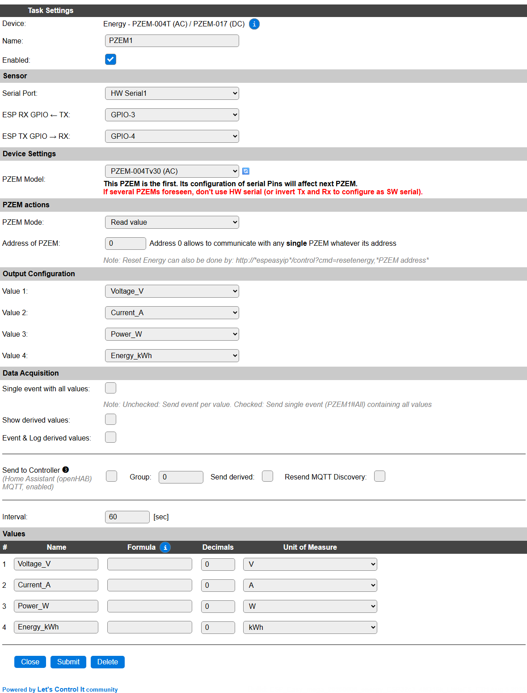
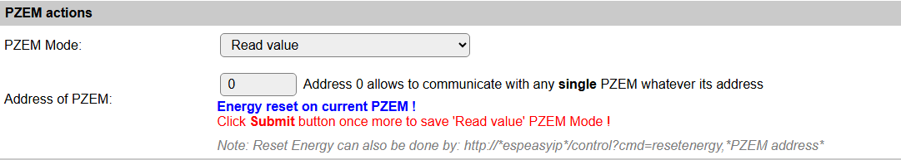
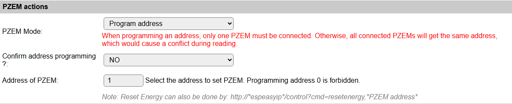
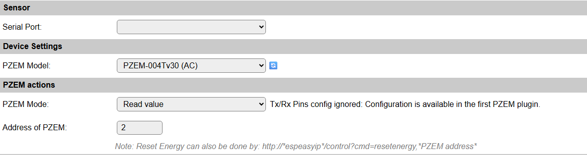

.. include:: ../Plugin/_plugin_substitutions_p10x.repl
.. _P102_page:

|P102_typename|
==================================================

|P102_shortinfo|

Plugin details
--------------

Type: |P102_type|

Name: |P102_name|

Status: |P102_status|

GitHub: |P102_github|_

Maintainer: |P102_maintainer|

Used libraries: |P102_usedlibraries|

Description
-----------

PZEM-004T (AC) V3.0 or Version 3.0 is the upgraded version to replace the old PZEM004T V1.0. 
The old version has been sold out in most of the online store and is no longer being produced.

Improvements over V1:

* Higher resolution
* More samples per second
* Increased stability

Specifications
--------------

Voltage
^^^^^^^

* Measuring range: 80 - 260V
* Resolution: 0.1V
* Measurement accuracy: 0.5%

Power factor
^^^^^^^^^^^^

* Measuring range: 0.00 - 1.00
* Resolution: 0.01
* Measurement accuracy: 1%

Frequency
^^^^^^^^^

* Measuring range: 45Hz - 65Hz
* Resolution: 0.1Hz
* Measurement accuracy: 0.5%

Current
^^^^^^^

* Measuring range:

  * 0 - 10A(PZEM-004T-10A)
  * 0 - 100A(PZEM-004T-100A)

* Starting measure current: 

  * 0.01A(PZEM-004T-10A)
  * 0.02A(PZEM-004T-100A)

* Resolution: 0.001A 

  * 0.001A(PZEM-004T-10A)
  * 0.01A(PZEM-004T-100A)

* Measurement accuracy: 0.5%

Active power
^^^^^^^^^^^^

* Measuring range: 

  * 0 - 2.3kW(PZEM-004T-10A)
  * 0 - 23kW(PZEM-004T-100A)

* Starting measure power: 0.4W
* Resolution: 0.1W
* Measurement accuracy: 0.5%

Active Energy
^^^^^^^^^^^^^

* Measuring range: 0 - 9999.99kWh
* Resolution: 1Wh
* Measurement accuracy: 0.5%

Description
-----------

PZEM-017 v1.0/v2.0 (DC) For measuring DC loads. When the voltage is below 7V, an independent (**not from PC USB port!**) USB powersupply should be used on the USB input connector.

Specifications
--------------

Voltage
^^^^^^^

* Measuring range: 0.05 - 300V
* Resolution: 0.01V
* Measurement accuracy: 1%

Current
^^^^^^^

* Measuring range:

  * 0.02 - 50/100/200/300A(Depending on shunt)

* Resolution: 0.01A 

* Measurement accuracy: 1%

Active power
^^^^^^^^^^^^

* Measuring range: 

  * 0.2 - 90kW(Depending on shunt)

* Starting measure power: 0.2W
* Resolution: 0.1W
* Measurement accuracy: 1%

Active Energy
^^^^^^^^^^^^^

* Measuring range: 0 - 9999.99kWh
* Resolution: 1Wh
* Measurement accuracy: 1%

Installation and configuration
------------------------------

When installing multiple PZEM devices on a single ESP unit, some specific order of configuration is required to be able to correctly configure a second, third, etc. PZEM.

This is described below, in the :cyan:`Installing multiple PZEM units on a single ESP` paragraph.

Configuration
-------------

Task Settings
^^^^^^^^^^^^^

* **Name**: Required by ESPEasy, must be unique among the list of available devices/tasks.

* **Enabled**: The device can be disabled or enabled. When not enabled the device should not use any resources.

Sensor
^^^^^^

See: :ref:`SerialHelper_page`

Device Settings
^^^^^^^^^^^^^^^

* **PZEM Model**: Select the PZEM model that is to be handled by this task. (For changing the Address the model doesn't matter as they use the same command.)

Available options:

* *PZEM-004Tv30 (AC)*: The AC model, and default setting.
* *PZEM-017v1 (DC)*: The DC model. Also compatible with later v2/2.0 models.

For reading the correct values from a PZEM-017, that Model *must* be selected as it uses a different data format to fetch the results.

PZEM Actions
^^^^^^^^^^^^

* **PZEM Mode**: By default, the ``Read value`` option is selected.

Available options:

* *Read value*: Normal operating mode, for reading the configured values from the PZEM.
* *Reset Energy*: For resetting the counted total energy, this option can be selected. See below for a description.
* *Program address*: Only available on the *first* PZEM device, for changing the PZEM unit MODBUS address, as described below.

|

* **Address of PZEM**: Set to the address of the PZEM unit to be used. When only a single device is connected, can be set to 0, as a sort of 'universal' address.

Available address range for the *first* PZEM device: 0 .. 247, on subsequent PZEM devices: 1 .. 247.

Output Configuration
^^^^^^^^^^^^^^^^^^^^

For all 4 available Values slots for this task, a value to use can be selected here. The available options depend om the **PZEM Model** setting:

* *Voltage_V*
* *Current_A*
* *Power_W*
* *Energy_kWh*
* *Power_Factor_cosphi*: for ``PZEM-004Tv30 (AC)`` only.
* *Frequency_Hz*: for ``PZEM-004Tv30 (AC)`` only.

.. include:: DataAcquisition.repl

* **Interval**: By default, Interval will be set to 60 sec for this plugin. It is the frequency used to read sensor values and send these to any Controllers configured for this device.

Values
^^^^^^

The measured values are configured above, and get their names based on the selection made there.

For a complete description of all available columns see the `Plugin - Values <_Plugin.html#values>`_ section.

|

.. Events
.. ~~~~~~

.. .. include:: P102_events.repl

Resetting the Energy counter
----------------------------

For resetting the counted Energy value in the PZEM unit, there are 2 methods:

1. Use the *Reset Energy* **PZEM Mode** setting.
2. Send the command ``resetenergy,<modbus_address>`` to the ESP unit. This can be done via the Command entry on the Tools page, from Rules, or via a url command as shown in the configuration page.

Use the *Reset Energy* **PZEM Mode** setting
^^^^^^^^^^^^^^^^^^^^^^^^^^^^^^^^^^^^^^^^^^^^

For resetting the incrementing Energy counter in the PZEM unit, this PZEM Mode option can be used.

* Set **PZEM Mode** to ``Reset Energy``, and :cyan:`Submit` the page.

The command will be executed immediately, and afterward the status will shown:

The blue message showing that the command was sent. The **PZEM Mode** is already reset to ``Read value``.

To store this change in settings, the :cyan:`Submit` button should be used once more (you can of course change more settings if desired, that's why no automatic save is done.)

Send the ``resetenergy,<modbus_address>`` command
^^^^^^^^^^^^^^^^^^^^^^^^^^^^^^^^^^^^^^^^^^^^^^^^^

For an easy alternative to reset the Energy counter, you can use the ``resetenergy,<modbus_address>`` command, f.e. from the ``Command`` field on the Tools page, to reset the counter for the specific modbus address (range 1..247, or 0 if only 1 device is on the bus).

Installing multiple PZEM units on a single ESP
----------------------------------------------

Configuring separate MODBUS addresses on each device
^^^^^^^^^^^^^^^^^^^^^^^^^^^^^^^^^^^^^^^^^^^^^^^^^^^^

To uniquely identify each PZEM unit on the bus, it has to be configured to use a unique address. The range of these addresses is 1 .. 247.

* Add the, numerically, first PZEM task, f.e. in Devices slot 1.

* Configure the serial port, and on ESP32 also the GPIO pins, to be used, enable the plugin, and connect a single PZEM to the RS485 converter. When using ``HW Serial0``, the Serial Console Settings, on the Tools/Advanced page, have to be disabled to avoid issues with his port.

* Set **PZEM Mode** to ``Program address`` and :cyan:`Submit` the page.

Fill the desired address in the **Address of PZEM** field, change the **Confirm address programming ?** field to ``YES``, and again :cyan:`Submit` the page.

When successful, a message :green:`Address programming done !` is displayed, and the **PZEM Mode** is set to the default ``Read value`` setting.

* Disconnect the PZEM unit from the RS485 bus, connect the next PZEM unit, and repeat above steps, using a diferent **Address of PZEM** value, for all units to be connected.

N.B.: The last set Address of PZEM will be kept in the configuration, but can be changed to the desired first PZEM unit.

N.B.2: To correctly store the **PZEM Mode** setting, the configuration should be saved once more, using the :cyan:`Submit` button!

Configuring a secondary PZEM unit
^^^^^^^^^^^^^^^^^^^^^^^^^^^^^^^^^

The first PZEM unit can be configured as shown above in the generic Configuration paragraph. Once thats completed, with the correct, unique, MODBUS Address set, both in all PZEM units to connect and the task configuration for the first PZEM task, that task should be Enabled, so the next task added can detect that it will be the second (or third, etc.) device on the MODBUS chain.

After that task is running, a new PZEM task can be added, with a task number higher than the *first* PZEM task.

.. warning:: This is crucial for the PZEM tasks to start correctly, and in the correct order, on reboot or power-up of the ESP!

These secondary PZEM tasks do not use the Serial configuration, as they use the same connection as the *first* PZEM task.

Sensor
^^^^^^

This selector should not be used, as it is ignored.

Device Settings
^^^^^^^^^^^^^^^

* **PZEM Model**: Select the PZEM model that is to be handled by this task. (Changing the selection will save the new setting and reload the page.)

For reading the correct values from a PZEM-017, that Model *must* be selected as it uses a different data format to fetch the results.

PZEM Actions
^^^^^^^^^^^^

* **PZEM Mode**: By default, the ``Read value`` option is selected.

Available options:

* *Read value*: Normal operating mode, for reading the configured values from the PZEM.
* *Reset Energy*: For resetting the counted total energy, this option can be selected. See above for a description.

* **Address of PZEM**: Set to the address of the PZEM unit to be used.

Available address range: 1 .. 247.

When using the same address as the *first* PZEM task, and the **PZEM Model** connected is a ``PZEM-004Tv30 (AC)``, the extra values ``Power_Factor_cosphi`` and ``Frequency_Hz`` can be made available in a task, for sending to a controller.

|

Commands
--------

.. include:: P102_commands.repl

Change log
----------

.. versionchanged:: 2.0
  ...

  |added| 2025-08-06: Support for PZEM-017, updated documentation.

  |added| 2020-04-25
