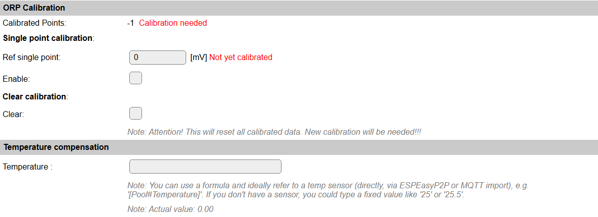
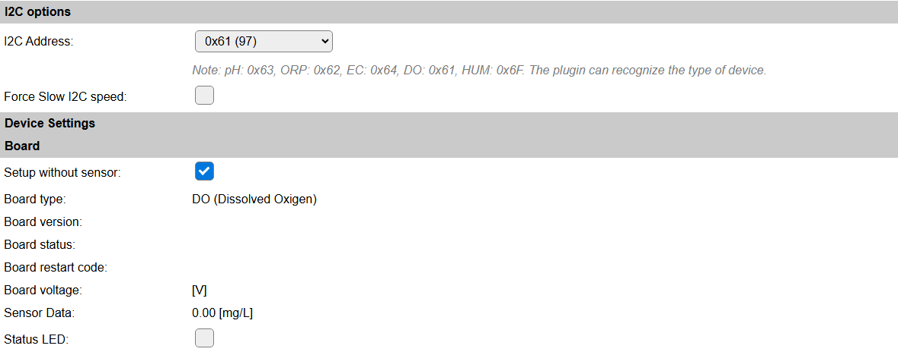

.. include:: ../Plugin/_plugin_substitutions_p10x.repl
.. _P103_page:

|P103_typename|
==================================================

|P103_shortinfo|

Plugin details
--------------

Type: |P103_type|

Name: |P103_name|

Status: |P103_status|

GitHub: |P103_github|_

Maintainer: |P103_maintainer|

Used libraries: |P103_usedlibraries|

Datasheet: |P103_datasheet|

Description
-----------

Several Atlas Scientific EZO sensors are supported by this plugin. Only I2C communication is supported, some sensors use that by default, and most other sensors can be re-configured from RS232 to I2C communication.

Currently there is support for:

* **pH**: Potential of Hydrogen (Acidity)

* **ORP**: Oxidation Reduction Potential

* **EC**: Electrical Conductivity

* **DO**: Dissolved Oxigen

* **HUM**: Humidity (Can also provide Temperature and Dewpoint measurements)

Device configuration
--------------------

* **Name**: A unique name should be entered here.

* **Enabled**: The device can be disabled or enabled. When not enabled the device should not use any resources.

I2C options
^^^^^^^^^^^

The available settings here depend on the build used. At least the **Force Slow I2C speed** option is available, but selections for the I2C Multiplexer can also be shown. For details see the :ref:`Hardware_page`

When loading the Device configuration page, the plugin will try to detect the type of sensor connected based on the selected I2C addresses. If no sensor is found, the message in red will be shown.

If no sensor is connected, the configuration can still be shown by selecting the **Setup without sensor** checkbox, choosing the I2C address for the intended sensor, and submitting the page.

Device settings
^^^^^^^^^^^^^^^

Board
^^^^^

This section shows relevant information, obtained from the sensor if actually connected.

* **Status LED**: The status led on the sensor can be enabled or disabled, using this checkbox.

For each board there are different device parameters available, but when using the device simulation, no actual device information is available, so no data is shown.

Board pH
^^^^^^^^

pH Calibration
^^^^^^^^^^^^^^

For the pH sensor, some calibration may be needed. The simulated device doesn't have any calibration data set.

For compensation of temperature, either a fixed temperature or a value from a connected temperature sensor can be selected. For this connected temperature sensor, the ``[<Taskname>#<valuename>]`` notation can be used. This will will be evaluated when the value is needed.

Board ORP
^^^^^^^^^

ORP Calibration
^^^^^^^^^^^^^^^

For the ORP sensor, some calibration may be needed. The simulated device doesn't have any calibration data set.

For compensation of temperature, either a fixed temperature or a value from a connected temperature sensor can be selected. For this connected temperature sensor, the ``[<Taskname>#<valuename>]`` notation can be used. This will will be evaluated when the value is needed.

Board EC
^^^^^^^^

EC Calibration
^^^^^^^^^^^^^^

For the EC sensor, some calibration may be needed. The simulated device doesn't have any calibration data set.

For compensation of temperature, either a fixed temperature or a value from a connected temperature sensor can be selected. For this connected temperature sensor, the ``[<Taskname>#<valuename>]`` notation can be used. This will will be evaluated when the value is needed.

Board DO
^^^^^^^^

DO Calibration
^^^^^^^^^^^^^^

For the DO sensor, some calibration may be needed. The simulated device doesn't have any calibration data set.

Board HUM
^^^^^^^^^

HUM Calibration
^^^^^^^^^^^^^^^

For the HUM sensor, no calibration can be adjusted, but options to enable the Temperature and/or Dew-point measurements are available.

To make the Temperature and Dew-point available for use, extra values are available:

.. include:: DataAcquisition.repl

* **Interval** By default, Interval will be set to 60 sec. The data will be collected and optionally sent to any configured controllers using this interval.

Values
^^^^^^

For all sensors, the **SensorData** and **Voltage** values are available. For the **HUM** Humidity sensor, also **Temperature** and **Dew-point** values are available, but have to be enabled in options to return a sensible value.

In selected builds, per Value **Stats** options are available, that when enabled, will gather the measured data and present most recent data in a graph, as described here: :ref:`Task Value Statistics:  <Task Value Statistics>`

Change log
----------

.. versionchanged:: 2.0
  ...

  |added| 2023-10-17 Add HUM sensor

  |added| 2020-04-25
