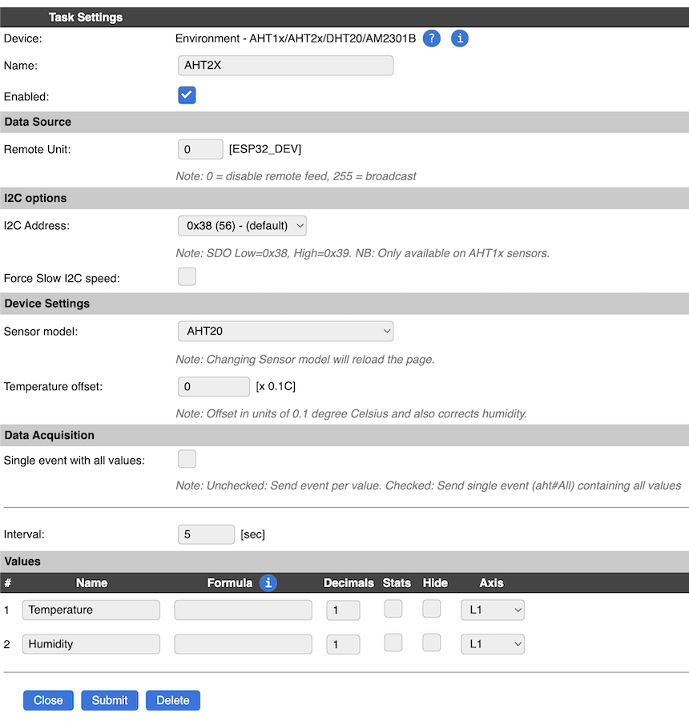
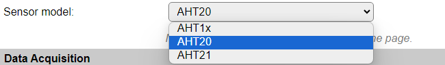
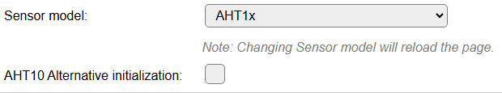

.. include:: ../Plugin/_plugin_substitutions_p10x.repl
.. _P105_page:

|P105_typename|
==================================================

|P105_shortinfo|

Plugin details
--------------

Type: |P105_type|

Name: |P105_name|

Status: |P105_status|

GitHub: |P105_github|_

Maintainer: |P105_maintainer|

Used libraries: |P105_usedlibraries|

Datasheet: |P105_datasheet| |P105_datasheet2| |P105_datasheet3|

Description
-----------

The AHT10/AHT15/AHT20/AHT21/DHT20/AM2301B sensors provide Temperature and Humidity measurements (factory calibrated), via an I2C bus connection.

.. warning::

  * The **AHT10** and **AHT15** devices do sometimes not 'play nice' when there are also other I2C devices on the same bus (many complaints can be found on the internet). NB: This may be hardware-, vendor-, or chip-revision-specific.

Because of this peculiarity, other sensors may be more appropriate, like the AHT20/AHT21 also supported by this plugin, or :ref:`P028_page`, :ref:`P106_page`, :ref:`P014_page`, :ref:`P034_page`, :ref:`P051_page`, :ref:`P068_page` or :ref:`P072_page`.

This plugin tries to avoid such situations (I2C bus lock) by (soft) resetting the sensor if it doesn't respond for some time.

This plugin also supports the **DHT20** and **AM2301B** sensors, as these are just **AHT20** sensors with a specific housing.

Settings
--------

* **Name**: The name for this task, should be unique.

* **Enabled**: Allows to enable/disable the device.

I2C Options 
^^^^^^^^^^^^

The available settings here depend on the build used. At least the **Force Slow I2C speed** option is available, but selections for the I2C Multiplexer can also be shown. For details see the :ref:`Hardware_page`

* **I2C Address**: The address the device is using. The AHT10 sensor allows to select a secondary address by pulling the AO (sometimes marked as A0) pin to high (3.3V) to select the secondary address. That address should then be selected here too. The AHT20/AHT21 based sensors only support a single I2C address, so it will be forced to the default address.

Device Settings
^^^^^^^^^^^^^^^^

If the plugin is configured for **Sensor model** AHT1x and other devices configured in a task use the I2C bus, a warning is displayed (see example below) that combining them with this device may cause issues on the I2C bus, resulting in all I2C devices no longer working as intended. This may occur immediately, or only after some time, like 10 minutes or an hour.

* **Sensor model** Selection of the connected type of hardware. (AHT2x based sensors have a slightly different intialization.)

Available options:

* **AHT1x** AHT10/AHT15. These sensor models should better be avoided, as it doesn't always work with other devices on the same I2C bus.

* **AHT20** An more modern version of the sensor. Use this option also when connecting a DHT20 or AM2301B sensor.

* **AHT21** An more modern version of the sensor, very similar to the AHT20, in a more compact chip package.

When selecting the **AHT1x** Sensor model, an extra option is made available:

* **AHT10 Alternative initialization**: Some AHT10 clone sensors do not seem to like the regular AHT10/AHT15 initialization sequence. They do however accept a soft reset command. By enabling this checkbox, only the soft reset is sent to the device. Only available for AHT1x devices.

* **Temperature offset** Depending on the sensor and the location of the sensor, it may be required to apply some temperature compensation. This can be set in steps of 0.1 degree. This also applies a compensation to the **Humidity** reading.

.. include:: DataAcquisition.repl

* **Interval** By default, Interval will be set to 60 sec. It is the frequency used to read sensor values and send these to any Controllers configured for this device.

Values
^^^^^^

The names for the values are initially set to a default name, but can be changed if desired. Also, a formula can be entered to re-calculate the value before display/sending to a controller, and the number of decimals can be changed, for Temperature, usually 1 decimal is enough to be displayed (value will be rounded).

Change log
----------

.. versionchanged:: 2.0
  ...
  |changed| 2024/12/21 Add temperature offset

  |changed| 2024-12-03 Add alternative initialization option

  |added| 2021-08-01 Moved from ESPEasy PluginPlayground to the main repository.
