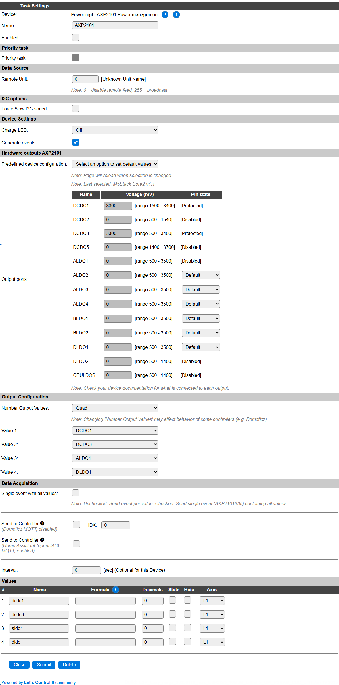
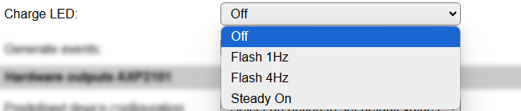
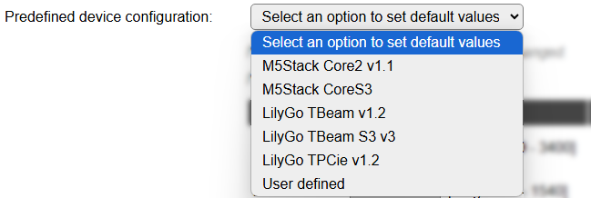
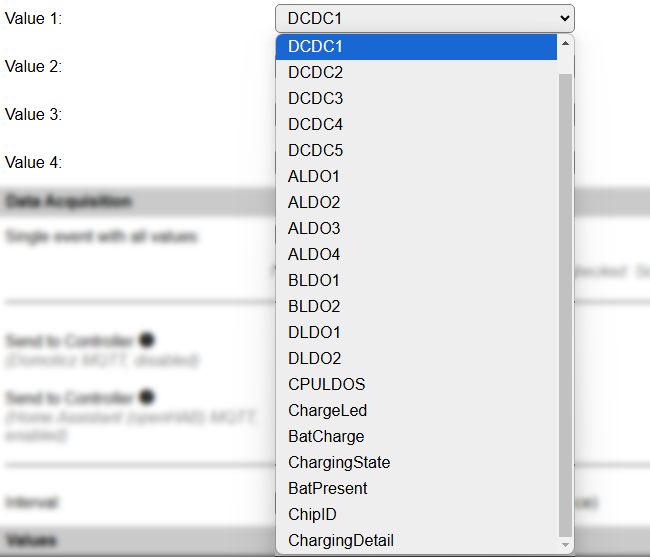
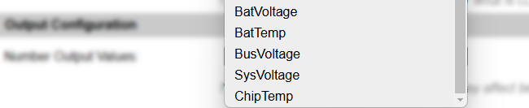

.. include:: ../Plugin/_plugin_substitutions_p13x.repl
.. _P139_page:

|P139_typename|
==================================================

|P139_shortinfo|

Plugin details
--------------

Type: |P139_type|

Name: |P139_name|

Status: |P139_status|

GitHub: |P139_github|_

Maintainer: |P139_maintainer|

Used libraries: |P139_usedlibraries|

Description
-----------

I2C Power management controller. As found in some ESP32 models of M5Stack and TTGO.

Plugin is only available in ESP32 builds, as the library uses some software constructs that aren't available for ESP8266, and this controller is currently only found to be used with ESP32 boards.

Configuration
--------------

* **Name** A unique name should be entered here.

* **Enabled** The device can be disabled or enabled. When not enabled the device should not use any resources.

.. include:: PriorityTask.rst

I2C Options 
^^^^^^^^^^^^

The available settings here depend on the build used. At least the **Force Slow I2C speed** option is available, but selections for the I2C Multiplexer can also be shown. For details see the :ref:`Hardware_page`

Device Settings
^^^^^^^^^^^^^^^^

* **Charge LED**: Select the working of the Charge LED (if that's available on your device). Available options:

* *Off*: Do not turn the LED on during charging.

* *Flash 1Hz*: The LED will flash in a slow 1Hz tempo during charging.

* *Flash 4Hz*: The LED will flash in a somewhat faster 4Hz rate during charging.

* *Steady On*: The LED will be on during charging.

..

* **Generate events**: Generate events when the charging state changes. There are 2 event values for this event: ``<taskname>#ChargingState=<NewState>,<OldState>``.

Hardware ports AXP2101
^^^^^^^^^^^^^^^^^^^^^^

* **Predefined device configuration** The plugin provides presets for some specific devices:

* *Select an option to set default values*: This option will always be selected when opening the page.

* *M5Stack Core2 v1.1*: Settings for the M5Stack Core2 v1.1, and some derived special models, hardware (not for v1.0 hardware).

* *M5Stack Core S3*: Settings for the M5Stack S3 hardware.

* *LilyGO T-Beam v1.2*: Settings for the LilyGO T-Beam v1.2 series of GPS/LoRa devices with optional OLed display (not for v1.0 or v1.1 models).

* *LilyGO T-Beam S3 v3*: Settings for the LilyGO T-Beam S3 v3 series hardware.

* *LilyGO T-Pcie v1.2*: Settings for the LilyGO T-Pcie v1.2 series hardware.

* *User defined*: To be able to configure all available ports the User defined option is added, f.e. when using a custom designed, or not yet supported, hardware setup.

When available, new predefined devices will be added. The User defined option will stay the last option.

Depending on the selected configuration, the ports of the AXP2101 can be set at a predefined value. When setting a value below the minimum value (shown next to the voltage selector), the port will be turned off. Above the maximum voltage is not supported/allowed. Stepsize/resolution depends on the port, and can be found in the technical documentation of the AXP2101.

.. warning:: Check board documentation for what each port is actually connected to, and the allowed voltage range for that port.

For the available ports, the initial state can be selected. The available options are:

* *Off*: Sets the state to off level (0 V).

* *On*: Sets the state to on (high) level.

* *Default*: Doesn't set the state of the port.

If the column shows ``[Protected]`` or ``[Disabled]``, that port is not available for use in the current configuration or in the commands (see below).

Output Configuration
^^^^^^^^^^^^^^^^^^^^

* **Number Output Values**: Select the number of values that have to be available. The default is set to *Quad*, as there are far more than 4 values available for display.

Available options: *Single* (1), *Dual* (2), *Triple* (3) and *Quad* (4).

* **Value 1..4**: Select the desired value to be available in the Values fields. The name of the Values will be set to a matching default automatically, but can be changed afterward.

Available options:

* *None*: To leave the value empty/0.00

* *DCDC1* .. *CPULDOS*: The voltage of the port.

* *ChargeLed*: The state of the Charge LED, 0 = Off, 1 = Flash 1Hz, 2 = Flash 4Hz, 3 = Steady On.

* *BatCharge*: The charge state percentage of the battery.

* *ChargingState*: The state of charging, -1 = discharging, 0 = standby, 1 = charging.

* *BatPresent*: Is a battery present (1) or disconnected (0).

* *ChipID*: The ID set in the chip, 0 = not found, 71 = AXP2101.

* *ChargingDetail*: The detailed state of charging.

  * 0: ``tri-charge``
  * 1: ``pre-charge``
  * 2: ``constant charge (CC)``
  * 3: ``constant voltage (CV)``
  * 4: ``charge done``
  * 5: ``not charging``

* *BatVoltage*: The battery voltage.

* *BatTemp*: The temperature of the battery, (if a battery-temperature sensor is installed).

* *BusVoltage*: The bus-voltage.

* *SysVoltage*: The system-voltage.

* *ChipTemp*: The internal temperature of the chip.

.. note:: Not all options hold usable values for all boards, some may even be not connected. Check the board documentation for available values.

.. include:: DataAcquisition.repl

* **Interval** By default, Interval will be set to 0 sec. as it is optional. When set > 0 it is the frequency used to read sensor values and send these to any Controllers configured for this device.

Values
^^^^^^

The measured values are available in variables, where the initial names are determined by the selected **Value 1..4** settings. A formula can be set to recalculate. The number of decimals can be set as desired, and defaults to 2.

In selected builds, per Value **Stats** options are available, that when enabled, will gather the measured data and present most recent data in a graph, as described here: :ref:`Task Value Statistics:  <Task Value Statistics>`

Commands
~~~~~~~~

.. include:: P139_commands.repl

Extra values
~~~~~~~~~~~~

As this plugin has more values available than can be set in the regular Values fields, all values are also available from the Get Config feature.

.. include:: P139_values.repl

Extra events
~~~~~~~~~~~~

Besides the regular events, of ``<taskname>#<valuename>=<value>`` or ``<taskname>#All=<value1>,..<valueN>`` when the **Interval** is set, there can be an extra event generated:

.. include:: P139_events.repl

Change log
----------

.. versionchanged:: 2.0

  |added| 2025-01-19 Initially added.
