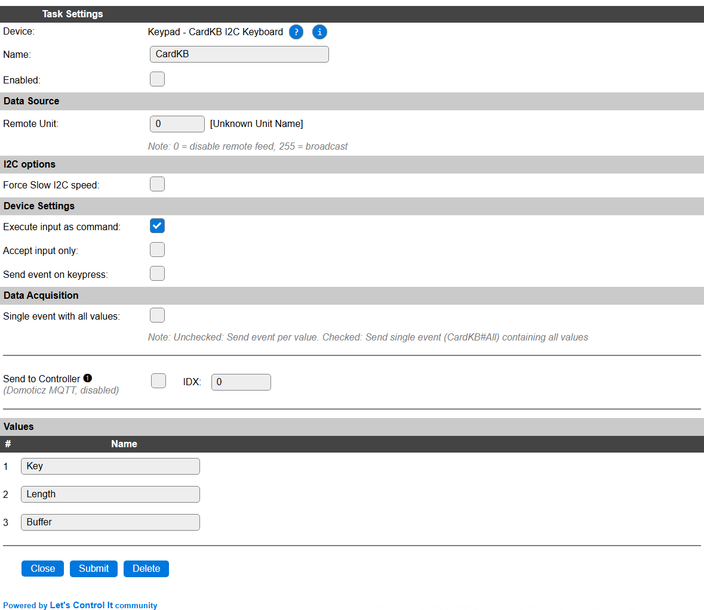
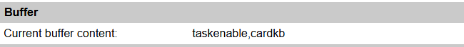
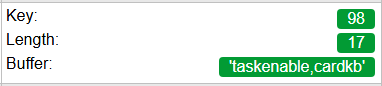

.. include:: ../Plugin/_plugin_substitutions_p14x.repl
.. _P140_page:

|P140_typename|
==================================================

|P140_shortinfo|

Plugin details
--------------

Type: |P140_type|

Name: |P140_name|

Status: |P140_status|

GitHub: |P140_github|_

Maintainer: |P140_maintainer|

Used libraries: |P140_usedlibraries|

Description
-----------

M5Stack CardKB I2C ASCII input keyboard support.

Can be used to enter commands as if typing via USB serial to the device. It can also be used as input for a GUI, built using the AdaGFX_helper graphics commands, or a menu/button configuration via the Extended Touch panel, by handling the ``Key`` values in Rules.

Only printable ASCII characters (a-z, A-Z, 0-9, space and punctuation) will be appended to the input buffer. The ``Del`` key can be used for corrections (backspace), and ``Enter`` to submit the input. Other keys can be handled in Rules if **Send event on keypress** is enabled.

Configuration
--------------

* **Name** A unique name should be entered here.

* **Enabled** The device can be disabled or enabled. When not enabled the device should not use any resources.

I2C Options 
^^^^^^^^^^^^

The available settings here depend on the build used, and configuration options set. At least the **Force Slow I2C speed** option is available, but selections for the I2C Multiplexer can also be shown. For details see the :ref:`Hardware_page`

Device Settings
^^^^^^^^^^^^^^^^

* **Execute input as command**: When enabled (default: On), input typed on the keyboard will be executed as a command when the ``Enter`` key is pressed, and corrections can be made by using the ``Del`` key, working as Backspace. When disabled, input will not be stored in the buffer (unless **Accept input only** is enabled), but should be handled in Rules by enabling **Send event on keypress**. After pressing ``Enter`` the buffer will be cleared.

* **Accept input only**: When enabled, it will accept input up until ``Enter`` is pressed, and *will send events* as if **Send event on keypress** was enabled. The buffer will also be cleared. If **Execute input as command** is also enabled, the input *is* also processed as a command. This is usually not the desired combination.

* **Send event on keypress**: When enabled will generate events with the ASCII code for the key. If **Execute input as command** or **Accept input only** are enabled, also the current buffer Length and Buffer content will be generated as events.

Buffer
^^^^^^

If the plugin is enabled, the **Current buffer content** is shown in this section. The value will *not* be automatically updated when adding or deleting characters to/from the buffer while the page is open.

.. include:: DataAcquisition.repl

**Interval** Is not available for this plugin, events will only be generated when the **Send event on keypress** setting is enabled, or **Accept input only** is enabled and ``Enter`` is pressed.

Values
^^^^^^

The current values are available in ``Key``, ``Length`` and ``Buffer``, limited to ``Key`` if **Execute input as command** and **Accept input only** are disabled. No decimals, formula or charting options are available.

To handle ``Buffer`` in Rules completely, the event handler has to be decorated with an asterisk, ``*``, to enable the possible non-numeric content of the buffer to be passed to the event handler:

.. code:: none

  On CardKB#Buffer* Do
    LogEntry,'CardKB: Current input buffer: %eventvalue1%'
  Endon

When enabling **Single event with all values**, this is't needed, as the first event argument ``Key`` will always be numeric.

.. code:: none

  On CardKB#All Do
    LogEntry,'CardKB: Last key: %eventvalue1%, Length: %eventvalue2%, Input buffer: %eventvalue3%'
  Endon

When **Execute input as command** is enabled, the current buffer content is shown in the Devices overview page:

(The buffer content is only quoted when needed, so it can be passed as a single argument to event handlers.)

Commands
~~~~~~~~

.. include:: P140_commands.repl

Change log
----------

.. versionchanged:: 2.0

  |added| 2025-02-08 Initially added.
