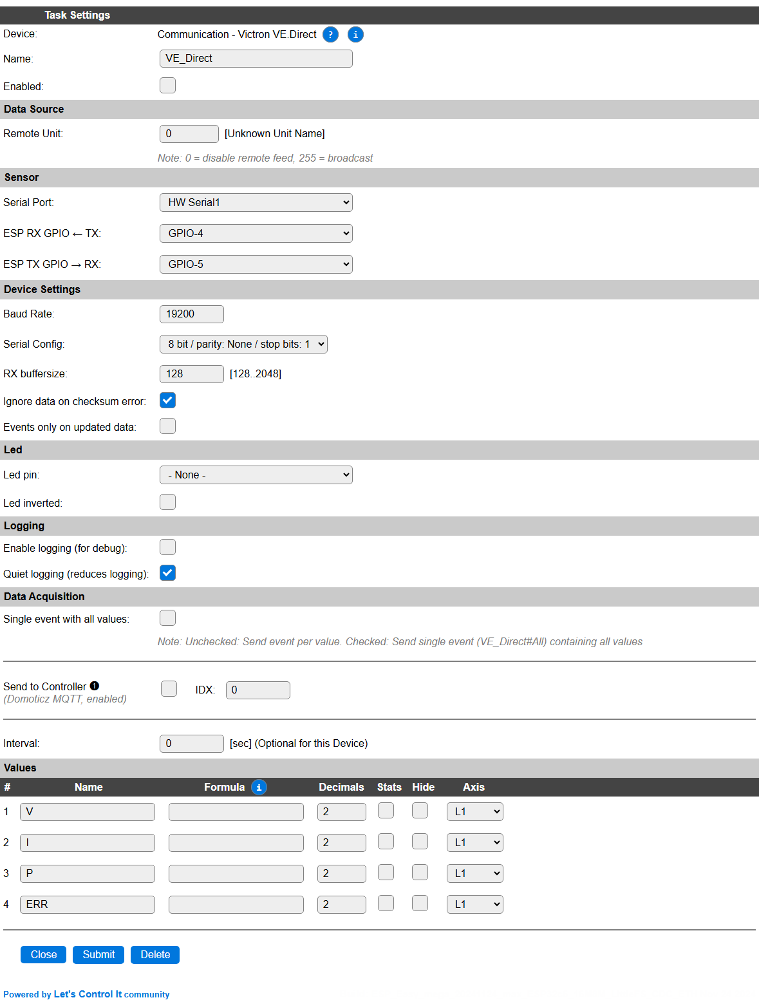
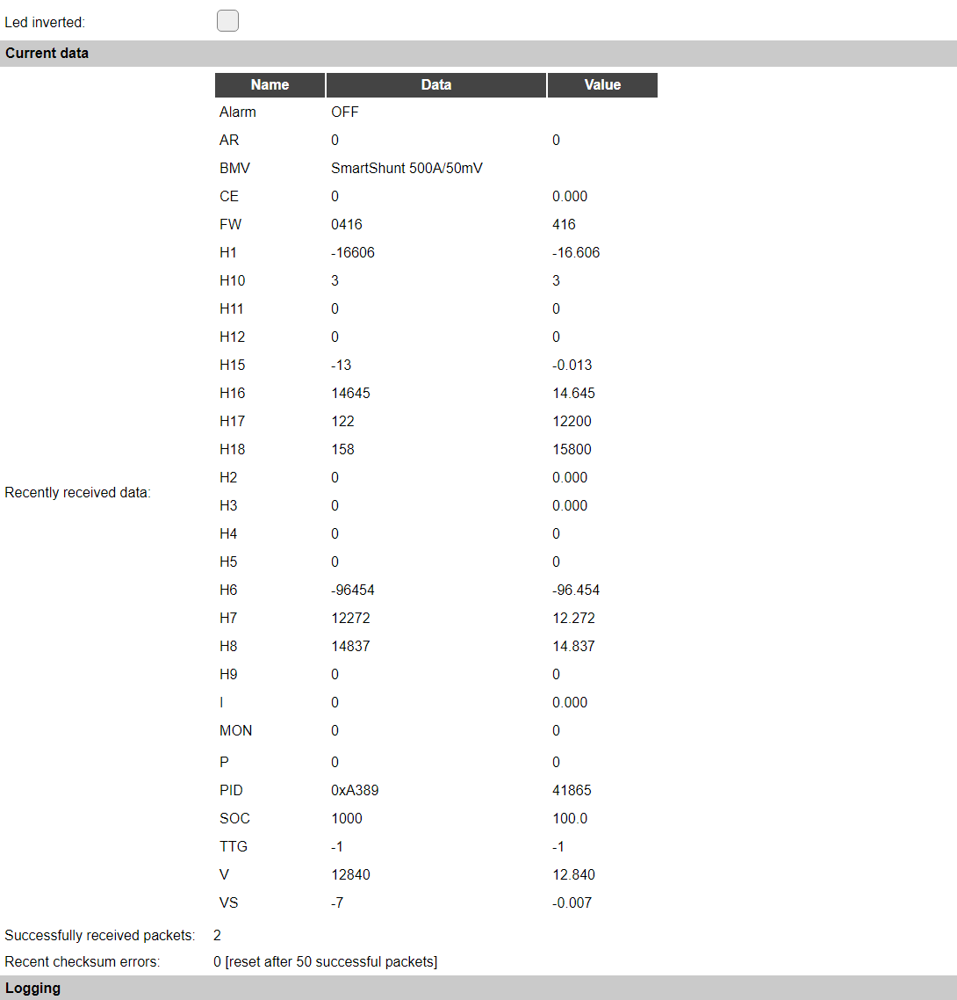

.. include:: ../Plugin/_plugin_substitutions_p17x.repl
.. _P176_page:

|P176_typename|
==================================================

|P176_shortinfo|

Plugin details
--------------

Type: |P176_type|

Name: |P176_name|

Status: |P176_status|

GitHub: |P176_github|_

Maintainer: |P176_maintainer|

Used libraries: |P176_usedlibraries|

Supported hardware
------------------

|P176_usedby|

Configuration
-------------

* **Name** In the Name field a unique name should be entered.

* **Enabled** When unchecked the plugin is not enabled.

Sensor
^^^^^^

See: :ref:`SerialHelper_page`

Device Settings
^^^^^^^^^^^^^^^

* **Baud Rate / Serial config**: See *Serial helper configuration*, above.

* **RX Buffersize**: The buffer to be used for ESPEasySerial, default and minimum is 128 bytes. Can be expanded up to 2048 bytes if processing of the received data takes too much time and data gets discarded. 

* **Ignore data on checksum error**: The protocol includes a checksum calculation, and when this fails, the data is probably unreliable, and should better be dismissed.

* **Events only on updated data**: With this checkbox enabled, events and outgoing data to Controllers is only sent if at least 1 new packet is received since the last Interval or TaskRun. When disabled, data is sent out every Interval, when data is available (so at least a single packet is successfully received). This option is only available if Checksum processing is included in the build.

Led
^^^

* **Led pin**: The GPIO pin a Led is connected to. To enable a *data is being processed* activity led.

* **Led inverted**: Inverts the on/off state for the Led.

Logging
^^^^^^^

* **Enable logging (for debug)**: When enabled, all received data, and the current checksum counter, are logged at INFO level, to validate if, and what, data is being received. During normal operation, this should be disabled.

* **Quiet logging (reduces logging)**: During normal operation there is some minimal logging available, informing about successfully received packets. This logging is suppressed when Quiet logging is enabled.

.. include:: DataAcquisition.repl

* **Interval** By default, Interval will be set to 0 sec. In this situation, no data is sent automatically, and no events are generated. The data will still be collected and can be retrieved for use on a display, or further processing from other rules. When an Interval is set the data can be optionally sent to any configured controllers and either a single ``#All`` event or an event per value will be generated. As an alternative, the ``TaskRun`` command can be used to publish the data at any moment.

Values
^^^^^^

The plugin provides all values that are received from a VE.Direct device. By entering the Name of such value here, that value will be made available. Some values are text-only, and can not be used in this way, but from rules these values can still be sent to a controller or shown on a display.

The number of decimals to use for displaying in the Devices overview and sending to Controllers, can be selected, and an optional formula can be applied to the available value, f.e. for applying some kind of correction.

In selected builds, per Value **Stats** options are available, that when enabled, will gather the measured data and present most recent data in a graph, as described here: :ref:`Task Value Statistics:  <Task Value Statistics>`

Values that are not configured in the Values section can still be retrieved from rules, or in a display configuration, by using the regular ``[<TaskName>#<ValueName>]`` notation. The ``<TaskName>`` is the name as set in the **Name** field, above, and the ``<TaskValue>`` is the name of the data item, available from the VE.Direct device. These names are *not* case-sensitive.

An overview of the data is shown when the task is enabled, and data is received (successfully) from a VE.Direct device.

Example data
------------

This example shows the data as can be received from a VE.Direct device.

The *Name* column is what should be used in the Values fields, or when as a ``<ValueName>`` from rules or in a display configuration. The exact meaning and unit of each field can be found in the VE.Direct protocol documentation, available from Victron Energy.

The *Data* column shows the actual data as received. If the checksum validation is enabled, this column may be empty if the checksum could not be verified, like the first (possibly incomplete) packet, but as the frequency of packets is rather high, this column should not often (or long) be empty.

The *Value* column shows a factored result based on the value, as mV is not always very useful, so that's converted to V, mA to A, Wh to kWh, etc.

For items that use ON and OFF (or On and Off for older firmwares) as Data, these will be available as 1 and 0 respectively, so they can be used as Values. If needed, a transformation like ``[VE.Direct#Alarm#O]`` can be used to present the value as ON/OFF for 1/0. Adding the ``C`` justification, like ``[VE.Direct#Alarm#O#C]``, will be presented as On/Off.

It shows that it has received 2 packets, but as a packet only contains a part of the available data, and a next packet another part, etc. there's no fixed relation to the amount of samples, and the number of packets received. Some devices may send all data in a single packet, other devices may need 3 or even 4 packets to send all available data.

Also, the number of checksum errors is shown, this counter is automatically reset after receiving 50 consecutive correct packets.

Get Config values
-----------------

All data values received can be retrieved by using the ``[<taskname>#<data_name>]`` syntax. To get the success count and error count, varables ``[<taskname>#successcount]`` and ``[<taskname>#errorcount]`` are available, and also the ``[<taskname>#updated]`` value, to see if data was updated since the last call for this variable (returns 0/1). So this should only be called once for evaluation. The ``errorcount`` value is reset after 50 succesful received packets, so after receiving 50 successful packets it will return 0.

Change log
----------

.. versionchanged:: 2.0
  ...

  |added| 2024-10-27: Initial release.

