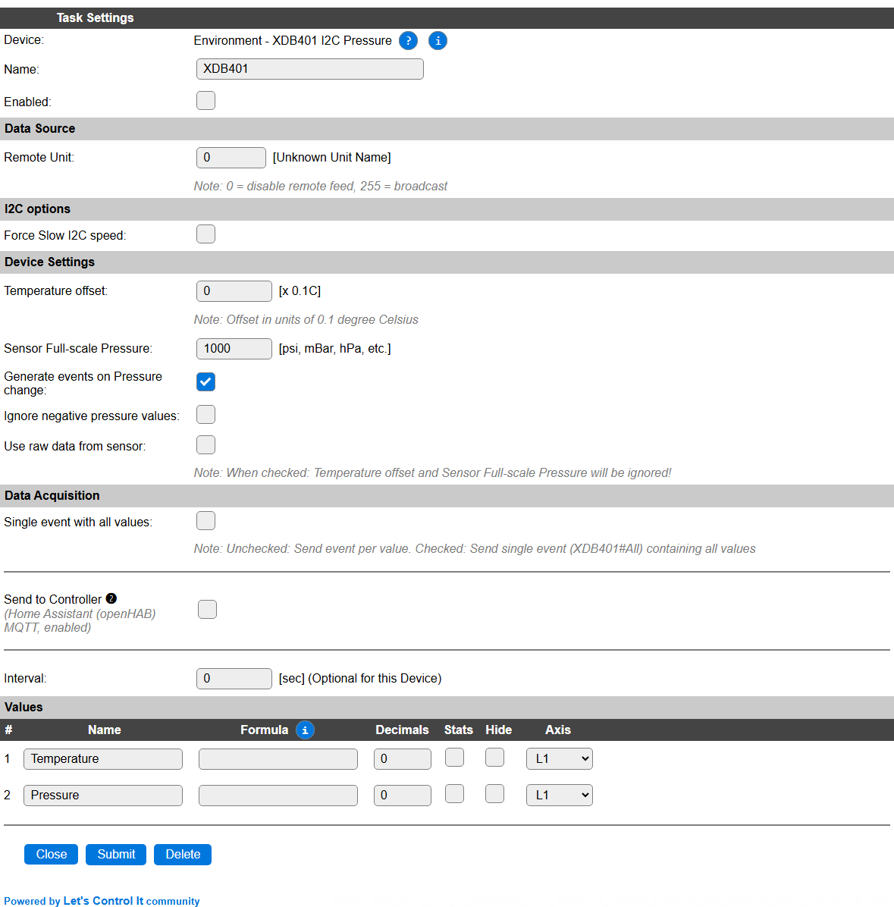

.. include:: ../Plugin/_plugin_substitutions_p17x.repl
.. _P177_page:

|P177_typename|
==================================================

|P177_shortinfo|

Plugin details
--------------

Type: |P177_type|

Name: |P177_name|

Status: |P177_status|

GitHub: |P177_github|_

Maintainer: |P177_maintainer|

Used libraries: |P177_usedlibraries|

Description
-----------

The XDB401 I2C Pressure and Temperature sensor is available in many configurations, with regard to the max. allowed pressure. It is placed in the Environment (Climate) category, as it can be used as a barometric pressure device. The Temperature measured is the device-temperature, so this could be taken into account when using the value.

Data is measured every 0.5 second, as for each measurement the sensor needs some time (~0.1 sec.) to get a reliable result.

Configuration
-------------

* **Name**: Required by ESPEasy, must be unique among the list of available devices/tasks.

* **Enabled**: The device can be disabled or enabled. When not enabled the device should not use any resources.

I2C options
^^^^^^^^^^^

The available I2C settings here depend on the build used. At least the **Force Slow I2C speed** option is available. This sensor can also be used with an I2C Multiplexer, as the (fixed) device address is ``0x7F`` to allow for multiple sensors on a single ESP. For details see the :ref:`Hardware_page`.

Device Settings
^^^^^^^^^^^^^^^

* **Temperature offset**: An offset from the current temperature can be applied in 0.1°C steps. The offset can be set here.

* **Sensor Full-scale Pressure**: This scaling factor determines the Unit of measure available in the Pressure variable. It should be set to the max. range of the device in use for the desired Unit of measure. No presets here, because of the many different full-range options available, that can be 'converted' to any required UoM.

* **Generate events on Pressure change**: When checked will generate the standard events as soon as a pressure difference is measured. This allows the **Interval** to be set to 0, and only on pressure changes the data will be published.

* **Ignore negative pressure values**: When checked, any negative pressure value will be reported as 0.

* **Use raw data from sensor**: When checked, no **Temperature offset** and **Sensor Full-scale Pressure** factor will be applied to the measured data. Is mostly useful for testing or when calibrating the sensor. Should probably be unchecked during normal operation.

Data Acquisition
^^^^^^^^^^^^^^^^

This group of settings, **Single event with all values** and **Send to Controller** settings are standard available configuration items. Send to Controller is only visible when one or more Controllers are configured.

* **Interval** Interval is optional, and will be set to 0 sec. The data will be collected and optionally sent to any configured controllers using this interval. When **Generate events on Pressure change** is enabled, this can be kept on 0, to only send out data when something changes.

Values
^^^^^^

The plugin provides the ``Temperature`` and ``Pressure`` values. A formula can be set to recalculate, f.e. when temperature has to be presented in ° Fahrenheit instead of ° Celcius: ``%c_c2f%(%value%)``. The number of decimals can be set as desired, and defaults to 2.

In selected builds, per Value **Stats** options are available, that when enabled, will gather the measured data and present most recent data in a graph, as described here: :ref:`Task Value Statistics:  <Task Value Statistics>`

.. Commands available
.. ^^^^^^^^^^^^^^^^^^

.. .. include:: P177_commands.repl

.. Get Config Values
.. ^^^^^^^^^^^^^^^^^

.. Get Config Values retrieves values or settings from the sensor or plugin, and can be used in Rules, Display plugins, Formula's etc. The square brackets **are** part of the variable. Replace ``<taskname>`` by the **Name** of the task.

.. .. include:: P177_config_values.repl

Change log
----------

.. versionchanged:: 2.0
  ...

  |added|
  2025-03-08 Initial release version.

