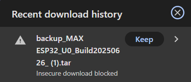

Migrate from SPIFFS to LittleFS (ESP32)
=======================================

Since Espressif IDF 5.x framework (ESP32 chips only), the SPIFFS file-system is no longer supported. As ESPEasy is using a specially crafted framework-release that still included SPIFFS support, we have been able to keep support for SPIFFS, but this requires quite some effort. To reduce that effort, and because SPIFFS won't be made available after IDF 5.1.x for ESPEasy (mega-20250430), it is strongly advised to migrate to a LittleFS build.

NB: A build can not have support for both SPIFFS *and* LittleFS. (Technical limitation.)

Using the 5 steps below, a safe (and easy) migration path is available:

0) Reset the P2P port to 0
1) Upgrade to the last release with SPIFFS support
2) Backup the current configuration and file-system content
3) Upgrade to the matching LittleFS release
4) Restore the backup

A more elaborate explanation of each step:

0) Reset the P2P port to 0
--------------------------

To ensure an uninterrupted upgrade, the ESPEasy P2P network feature should be **disabled** by setting the **ESPEasy p2p UDP port** to ``0`` on the Tools/Advanced page (take note of the port number before setting it to 0), and save that setting. This prevents the sometimes busy, high-priority, P2P traffic to interrupt the download process. After the migration is completed this can of course be re-enabled.

Click the Submit button to save the changed setting.

1) Upgrade to the last release with SPIFFS support
--------------------------------------------------

For the best experience, and to ensure a stable running system, the last release of ESPEasy **still including SPIFFS** should be used. This can be downloaded from `Github Release mega-20250430 <https://github.com/letscontrolit/ESPEasy/releases/tag/mega-20250430>`_

.. warning:: **The last release that includes ESP32 with SPIFFS support is** `mega-20250430 <https://github.com/letscontrolit/ESPEasy/releases/tag/mega-20250430>`_

In the previous paragraph is shown how to select the correct binary for upgrading. After a successful upgrade, the ESP will be rebooted, and should be left running for *at least* 5 minutes to ensure that the WiFi configuration is stored in the NVS (non-volatile storage) partiton of the flash (this is a background process, activated ~5 minutes after a successful connection to WiFI), to facilitate that these settings can be used to reconnect to WiFi after upgrading to a LittleFS build.

2) Backup the current configuration and file-system content
-----------------------------------------------------------

As all ESP32 builds include support for creating a .tar archive backup, this feature should now be used to create an up-to-date system backup, by using the :cyan:`Backup files` button (as opposed to the :cyan:`Save` button that only stores the configuration files), and storing the archive on a persistent storage medium (local disk, USB stick, network storage, etc.).

.. note:: NB: Depending on the browser used, it may be needed to confirm that the created archive should *really* be stored, so don't forget to confirm to **Keep** that!

3) Upgrade to the matching LittleFS release
-------------------------------------------

After the backup is created, the matching release with LittleFS support can be downloaded from the `Github Releases page <https://github.com/letscontrolit/ESPEasy/releases>`_ (If your build is not (yet) included, then please request it via a support issue. If your build was without the _ETH suffix, then you should pick the build *with* _ETH, as non-Ethernet builds are discontinued to reduce the number of builds.)

As long as the flash partitioning is the same (``4M316k``, ``8M1M`` etc.) the upgrade can be done via OTA by choosing the ``.bin`` file (*not* the ``.factory.bin``, that's for updating via a flash download tool). If the partitioning is different, either the `ESPEasy Web Flash tool <https://td-er.nl/ESPEasy/>`_ or the Espressif Flash Download tool should be used to install the update (flash partitioning can not be changed via an OTA update).

Once the new binary is installed, and the ESP rebooted, the unit should automatically connect to WiFi, as it has the last used credentials stored in the NVS partition. This may take upto a few minutes. Might that fail, the initial setup via the Setup portal should be started. (See below for troubleshooting tips if the unit doesn't come back online.)

4) Restore the backup
---------------------

Now that the unit is available via WiFi again, the backup we created in step **2)** can be restored so alle previously configured devices, controllers, rules, settings, etc. are available again.

From the Tools page, select the :cyan:`Load` button, and browse to the location of the backup .tar file to select it. After the restore is finished, the unit **must** be rebooted immediately (a :cyan:`Reboot` button is available), so the freshly restored settings won't be overwritten by any settings kept in memory.

After that mandatory reboot it is the moment to re-enable the P2P network, by restoring the **ESPEasy p2p UDP port** setting, on the Tools/Advanced page, with the port number noted in step **0)**. The default P2P port is ``8266``.

After saving the setting, the P2P network should be active again.

|

When these steps are completed, the migration from SPIFFS to LittleFS is **successfully completed!**

|

Some troubleshooting tips
-------------------------

Under certain circumstances it's possible the ESP doesn't connect to WiFi after the upgrade described in step **3)**, above.

There are several ways of resolving that:

* Re-enter the WiFi credentials via the WiFi AP that's started because the WiFi wouldn't connect:

Use a WiFi device, like a mobile phone, tablet or laptop to connect to the ESPEasy accesspoint (the AP name may be different, as it's for some builds based on the build used) (password: ``configesp``), browse to http://192.168.4.1/setup and select the WiFi AP the unit should connect to.

* No ESPEasy accesspoint is available:

Connect the ESP to an USB port on your computer, and use a terminal program, like Putty, or the WebFlasher at https://td-er.nl/ESPEasy (select Logs & Console after the correct COM port is connected), to connect to the console of ESPEasy.

There you can use a few commands to connect to WiFi: (each command should be followed by pressing the <Enter> key)

.. code-block:: none

  WiFiSsid,"<your_wifi_access_point_ssid>"
  WiFiKey,"<your_super-secret_wifi_password>"
  Save

If that still doesn't connect the ESP to the WiFi, then possibly the WiFi calibration data, stored on flash by the underlying frameworks, might interfere with the requirements of the current frameworks used.

Then this command can be used to reset & rebuild the WiFi calibration: ``EraseSDKWiFi``

Sometimes a reboot of the ESP is needed to properly rebuild and reconnect: ``reboot``

|
