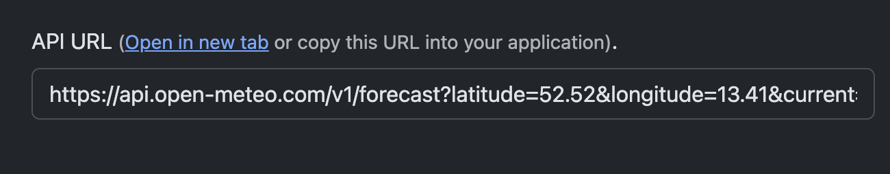

.. _HTTPResponseParser:

####################
HTTP Response Parser
####################

Introduction
============

The HTTP Response Parser are a set of parsers that can be used to parse the response of an HTTP request. They extract specific information from the response and use it in rules by generating specific events.

.. note:: These parsers are disabled by default and only available in max builds or custom builds where you have to enable them with either ``#define FEATURE_THINGSPEAK_EVENT 1``, ``#define FEATURE_OPENMETEO_EVENT 1`` or ``#define FEATURE_JSON_EVENT 1`` in the config.h file.

The Thingspeak Parser
---------------------

* ``SendToHTTP`` generates an event with the response of a thingspeak request (https://www.mathworks.com/help/thingspeak/readlastfieldentry.html & https://www.mathworks.com/help/thingspeak/readdata.html)
* There are two options:

  1. Get the value of a single field: 
  
     - Example command:
     	``SendToHTTP,api.thingspeak.com,80,/channels/143789/fields/5/last.csv``
     - Example of the resulting event:
     	``"EVENT: ThingspeakReply=143789,5,9.65"``
       
        | channel number = ``%eventvalue1%``
        | field number = ``%eventvalue2%``
        | value = ``%eventvalue3%``
        
  2. Get the values of all fields:
  
     - Example command:
     	``SendToHTTP,api.thingspeak.com,80,/channels/143789/feeds/last.csv``
     - Example of the resulting event:
     	``"EVENT: ThingspeakReply=143789,11.12,9.46,9.55,16.32,9.65,8.81,-1.23,14.76"``
        
        | channel number = ``%eventvalue1%``
        | values = ``%eventvalue2%`` to ``%eventvalue9%``

        .. note::
          ``last.csv`` is mandatory!
     
  .. warning:: When using the command for all fields, the reply can become extremely big and can lead to memory issues which results in instabilities of your device (especially when all eight fields are filled with very big numbers)

* Rules example:

  .. code:: none

    On Rules#Timer=1 Do
      SendToHTTP,api.thingspeak.com,80,/channels/143789/feeds/last.csv
    Endon

    On ThinkspeakReply Do
      LogEntry,'The channel number is: %eventvalue1%'
      LogEntry,'%eventvalue6%°C in Berlin'
      LogEntry,'%eventvalue7%°C in Paris'
    Endon

Added 2024/02/05
 
* Added the option to get a single value of a field or all values of a channel at a certain time (not only the last entry)

* Examples:
    
  Single channel: ``SendToHTTP,api.thingspeak.com,80,channels/143789/fields/1.csv?end=2024-01-01%2023:59:00&results=1``
    => gets the value of field 1 at (or the last entry before) 23:59:00 of the channel 143789
  
  All channels: ``SendToHTTP,api.thingspeak.com,80,channels/143789/feeds.csv?end=2024-01-01%2023:59:00&results=1``
    => gets the value of each field of the channel 143789 at (or the last entry before) 23:59:00 

  .. note::
    ``csv`` and ``results=1`` are mandatory!

The Open Meteo Parser
---------------------

* ``SendToHTTP`` generates an event with the response of an open-meteo.com request.

**Short description:**
Generates an event with the response of an Open-Meteo request.
No need for an API key and it is free (daily requests are limited to 10,000 in the free version).
Visit the URL (https://open-meteo.com/en/docs) and build your personal URL by selecting the location and values you want to receive.
Supported variable kinds are "current", "hourly", "daily"!
In rules, you can grep the reply by the kind of weather variables with ``On OpenMeteo# Do``.

**Example:** ``On OpenMeteo#current Do``.

.. note:: **"hourly"** and **"daily"** results are arrays which can become very long.
          It is best to make separate calls, especially for hourly results.

**How-To:**

1. Visit https://open-meteo.com/en/docs
2. Select in the side menu your topic (e.g., Weather Forecast, Marine Forecast, Air Quality)
3. Click together what you need and scroll down to the API Response section where you find this:

1. Copy everything after "open-meteo.com"
2. Use the copied part of the URL with SendToHTTP. Example: ``SendToHTTP,api.open-meteo.com,80,"/v1/forecast?..."`` (make sure to use the quotes!)

**Rules Example:**

.. code:: none

    On Rules#Timer=1 Do
        SendToHTTP,api.open-meteo.com,80,"v1/forecast?latitude=52.52&longitude=13.41&current=temperature_2m&hourly=temperature_2m&daily=temperature_2m_max&forecast_days=3"
    Endon

    On OpenMeteo#current Do 
        TaskValueSet 1,Outdoor,Temp,%eventvalue1% 
        TaskValueSet 1,Outdoor,Hum,%eventvalue2% 
        TaskValueSet 1,Outdoor,Baro,%eventvalue3% 
        TaskValueSet 1,Outdoor,UV,%eventvalue4% 
        LogEntry,'Values : Temp=%eventvalue1% Hum=%eventvalue2% Baro=%eventvalue3% UV=%eventvalue4%'
    Endon

    //this is a generic approach to grep all the different kinds of weather variables in one rules block
    On OpenMeteo* Do
        If {ord:%eventpar%} = 99 // the ordinal/integer value of the first character of "current" is 99
            LogEntry,'%eventpar% 1: %eventvalue1% 2: %eventvalue2% 3: %eventvalue3%'
        Elseif  {ord:%eventpar%} = 104 // the ordinal/integer value of the first character of "hourly" is 104
            LogEntry,'%eventpar% 1: %eventvalue1% 2: %eventvalue2% 3: %eventvalue3%'
        Elseif  {ord:%eventpar%} = 100 // the ordinal/integer value of the first character of "daily" is 100
            LogEntry,'%eventpar% 1: %eventvalue1% 2: %eventvalue2% 3: %eventvalue3%'
        Endif
    Endon

The gerneric JSON Parser
------------------------

* ``SendToHTTP`` generates an event with the response of a JSON request.
* The JSON parser is a generic parser that can be used to parse any JSON response.
  
**How-To:**

1. Add either #json or ?json to the end of the URL (either will always work) to tell ESPEasy that the response is in JSON format. 
   
   Example: ``SendToHTTP 192.168.1.199,80,"/solar_api/v1/GetInverterRealtimeData.cgi?Scope=System#json"`` 
    .. code-block:: json
        :caption: Example response:
        :class: collapsible

        {
            "Head" : {
                "RequestArguments" : {
                    "DataCollection" : "",
                    "Scope" : "System"
                },
                "Status" : {
                    "Code" : 0,
                    "Reason" : "",
                    "UserMessage" : ""
                },
                "Timestamp" : "2014-12-10T11:25:18+01:00"
            },
            "Body" : {
                "Data" : {
                    "PAC" : {
                            "Unit" : "W",
                            "Values" : {
                                "1" : 277
                            }
                    },
                    "DAY_ENERGY" : {
                            "Unit" : "Wh",
                            "Values" : {
                                "1" : 274
                            }
                    },
                    "TOTAL_ENERGY" : {
                        "Unit" : "Wh",
                        "Values" : {
                            "1" : 4173000
                        }
                    }
                }
            }
        }

2. Create a file called json.keys and add the keys you want the values from (each key in an extra line):
   
   .. code-block:: none
        :caption: Example:

        Body.Data.PAC.Values.1
        Body.Data.DAY_ENERGY.Values.1
        Body.Data.TOTAL_ENERGY.Values.1

3. Upload the file.

4. Grep the data with ``On JsonReply Do``.
   
**Extras:**

- Grouping or separate calls with different URLs.

1. Add a number to #json or ?json:
     
   e.g.: ``SendToHTTP 192.168.1.199,80,"/solar_api/v1/GetInverterRealtimeData.cgi?Scope=System#json1"``

2. Add the number + ":" to the key you want to group:
   
   .. code-block:: none
       :caption: Example:

       1:Body.Data.DAY_ENERGY.Values.1
       2:Body.Data.PAC.Values.1

3. Grep the data with ``On JsonReply#<number> Do``. 
    
   e.g.: ``On JsonReply#1 Do``

This way you can call more than one URL or put an array in a separate response, as the amount of event values would probably be too long.

**Rule example using %eventpar% to only have one rules block:**

.. code:: none

    On JsonReply* Do
      If %eventpar% = 1
        LogEntry,'Keygroup:%eventpar% DAY_ENERGY:%eventvalue1%'
      Elseif %eventpar% = 2
        LogEntry,'Keygroup:%eventpar% PAC:%eventvalue1%'
      Endif
    Endon

.. note:: When using groups in the key file but not adding a number at the end of the URL, ALL keys will be parsed!

